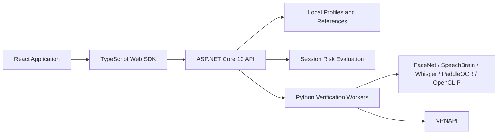

# SecureKit

**A multimodal biometric authentication toolkit with contextual risk evaluation.**

SecureKit brings face recognition, voice verification, keystroke dynamics, card comparison, and network context into a single application. It provides guided enrollment and sign-in, a verification playground, a typed browser SDK, and an HTTP API for exploring how multiple identity signals can support authentication decisions.

Developed as a graduation project, SecureKit connects a React application to an ASP.NET Core 10 backend and Python verification workers. Its modular design supports independent verification checks and policy-based session evaluation.

[Technical Wiki](https://deepwiki.com/MuratOzte/Multi-modal-biometric-authentication-toolkit) · [Getting Started](#getting-started) · [API Overview](#api-overview) · [Documentation](#documentation)

## What SecureKit Does

SecureKit supports two complementary workflows:

- **Guided enrollment and sign-in:** create a local account, record biometric consent, enroll reference samples, and complete face, card, voice, and typing checks through the application.
- **Verification playground:** exercise individual modules, inspect their results, and explore session policies with network, location, keystroke, and voice signals.

Developers and researchers can study both the user experience of biometric authentication and its underlying verification contracts. Results include module-specific scores, decisions, and diagnostic information. Session evaluations also report risk scores, reason codes, and required additional checks.

See the [application walkthrough](https://deepwiki.com/MuratOzte/Multi-modal-biometric-authentication-toolkit/4.3-demo-web-application) for the frontend structure and integration flow.

## Verification Capabilities

| Capability | How it works | Supported workflows |
| --- | --- | --- |
| **Keystroke dynamics** | Measures key hold times and transitions using key press and release events. | Behavioral profile enrollment, dynamic-text verification, and a separate Python-based fixed-text workflow. |
| **Face verification** | Uses MTCNN face detection and FaceNet embeddings for similarity comparison. | Reference enrollment, image comparison, capture sequences, and sliding-window reference management. |
| **Voice verification** | Combines SpeechBrain speaker embeddings with Whisper transcription. | Multi-sample enrollment, speaker comparison, and verification of spoken challenge text. |
| **Card verification** | Combines PaddleOCR text extraction with OpenCLIP visual similarity. | Reference enrollment, capture and alignment, extracted fields, and candidate comparison results. |
| **Network assessment** | Queries IP context through a Python integration with VPNAPI. | VPN, proxy, Tor, relay, and related risk indicators; mock mode for local development. |
| **Location policy** | Evaluates country context against configured rules. | Country restrictions and location signals in session evaluation. |

Face and card comparisons are available through dedicated endpoints and application steps. The current session risk contract accepts **network, location, keystroke, and voice** signals. Face liveness metrics and legacy adapters are experimental components; biometric matching does not establish certified spoof resistance or document authenticity.

Explore [verification services](https://deepwiki.com/MuratOzte/Multi-modal-biometric-authentication-toolkit/2.2-verification-services), [face and voice workers](https://deepwiki.com/MuratOzte/Multi-modal-biometric-authentication-toolkit/5.1-face-and-voice-workers), and [card verification](https://deepwiki.com/MuratOzte/Multi-modal-biometric-authentication-toolkit/5.2-card-verification-worker).

## Authentication Flow

1. **Create an account and record consent.** Associate enrollment data with a local user identifier.
2. **Enroll reference samples.** Capture face and card references, record voice samples, and build a typing profile.
3. **Submit verification samples.** Compare new captures against enrolled references. Voice and dynamic keystroke checks use short-lived, single-use text challenges.
4. **Evaluate session context.** Submit supported signals and a policy to the session API.
5. **Inspect the outcome.** Use the decision, reason codes, and required steps to drive the application flow.

| Session decision | Meaning |
| --- | --- |
| `allow` | The supplied signals satisfy the current policy. |
| `step-up` | Additional verification is required. |
| `deny` | The current policy rejects the evaluation. |

Policies configure risk thresholds, permitted countries, minimum network scores, VPN handling, additional verification steps, and keystroke or voice checks. Individual biometric endpoints use their own decision formats; the SDK exposes the corresponding types.

Read the [authentication decision model](https://deepwiki.com/MuratOzte/Multi-modal-biometric-authentication-toolkit/1.3-authentication-decision-model) and [session and risk services](https://deepwiki.com/MuratOzte/Multi-modal-biometric-authentication-toolkit/2.2.2-keystroke-session-and-risk-services).

## Architecture



The ASP.NET Core API handles HTTP requests, profile storage, challenge and session lifecycles, and worker execution. Python workers perform model inference. The browser SDK provides typed API methods and keystroke capture utilities. The original Express backend remains available for compatibility testing and rollback.

| Path | Responsibility |
| --- | --- |
| `apps/demo-web` | React + Vite application, guided authentication, and verification playground. |
| `apps/securekit-api` | Default ASP.NET Core 10 HTTP API. |
| `apps/securekit-api.tests` | xUnit HTTP, infrastructure, and contract tests. |
| `packages/web-sdk` | TypeScript browser client, transport, and keystroke recorders. |
| `packages/core` | Shared contracts, biometric scoring, policies, and orchestration. |
| `packages/node-auth` | Legacy Express backend, fixed-text worker, and API parity tooling. |
| `python` | Face, voice, card, and IP verification modules. |
| `scripts` | Development launcher, parity checks, and biometric acceptance tooling. |
| `docs` | API contracts, backend cutover instructions, and acceptance guides. |
| `apps/landing-web` | Project website and searchable technical wiki. |

See the [monorepo layout](https://deepwiki.com/MuratOzte/Multi-modal-biometric-authentication-toolkit/1.1-monorepo-layout-and-tooling) and [Python process bridge](https://deepwiki.com/MuratOzte/Multi-modal-biometric-authentication-toolkit/2.2.1-python-process-bridge).

## Getting Started

### Requirements

- **Node.js 22.12 or later**
- **pnpm 9.15.9**
- **.NET 10 SDK**; SDK selection is defined in `global.json`
- **Python 3.11** for the documented worker environments
- A browser with camera and microphone access for capture workflows

The following commands use PowerShell and run from the repository root. Separate Python environments are recommended for the biometric modules.

### Install and Run

```powershell
git clone https://github.com/MuratOzte/Multi-modal-biometric-authentication-toolkit.git
cd Multi-modal-biometric-authentication-toolkit

corepack enable
corepack prepare pnpm@9.15.9 --activate
pnpm install --frozen-lockfile
pnpm build

# Simulate IP assessment during local development.
$env:MOCK_IP_CHECK="1"
pnpm dev
```

| Service | Local address |
| --- | --- |
| Verification playground | [localhost:5173](http://localhost:5173) |
| Guided enrollment and sign-in | [localhost:5173/auth.html](http://localhost:5173/auth.html) |
| ASP.NET Core API | [localhost:3002](http://localhost:3002) |
| Health check | [localhost:3002/health](http://localhost:3002/health) |

`pnpm dev` builds the API and starts it alongside the application. Restart it after changing API code. If Vite selects another port, use the terminal address. Camera, microphone, and geolocation features require browser permissions and HTTPS when accessed remotely.

Mock mode only replaces the external IP lookup. Face, voice, and card checks require their Python environments and models. Dynamic-text keystroke verification runs without Python; fixed-text verification requires a Python interpreter.

To run separate processes, use `dotnet run --project apps/securekit-api` and `pnpm --filter demo-web dev` in separate terminals. To use the legacy backend, stop the launcher and run `pnpm dev:node`; its API listens on port `3001`.

See [local development](https://deepwiki.com/MuratOzte/Multi-modal-biometric-authentication-toolkit/1.2-getting-started-and-local-development) and the [backend cutover guide](docs/ASPNET_CUTOVER.md).

### Python Worker Setup

Set interpreter variables in the terminal that will start the API. Absolute paths ensure workers resolve correctly across workspace directories.

**IP assessment and fixed-text keystroke verification**

```powershell
py -3.11 -m venv .venv
.\.venv\Scripts\python.exe -m pip install -r python/requirements.txt
$env:PYTHON_BIN=(Resolve-Path .\.venv\Scripts\python.exe).Path
$env:PYTHON_CMD=$env:PYTHON_BIN

# Optional: use live IP assessment instead of mock mode.
$env:VPNAPI_KEY="YOUR_API_KEY"
$env:MOCK_IP_CHECK="0"
```

The fixed-text keystroke worker itself requires no additional Python packages.

**Face verification**

```powershell
py -3.11 -m venv .venv-face
.\.venv-face\Scripts\python.exe -m pip install -r python/face_verification/requirements.txt
$env:FACE_PYTHON_BIN=(Resolve-Path .\.venv-face\Scripts\python.exe).Path
$env:FACE_DEVICE="auto"
```

**Voice verification**

```powershell
py -3.11 -m venv .venv-voice
.\.venv-voice\Scripts\python.exe -m pip install -r python/voice_verification/requirements.txt
$env:VOICE_PYTHON_BIN=(Resolve-Path .\.venv-voice\Scripts\python.exe).Path
$env:VOICE_DEVICE="auto"
$env:VOICE_WHISPER_MODEL="base"
```

Whisper requires FFmpeg; the dependencies include an `imageio-ffmpeg` fallback. Model weights may download on first use.

**Card verification**

```powershell
py -3.11 -m venv .venv-card
.\.venv-card\Scripts\python.exe -m pip install -r python/card_verification/requirements.txt
$env:CARD_PYTHON_BIN=(Resolve-Path .\.venv-card\Scripts\python.exe).Path
```

Install a PaddlePaddle build compatible with your platform for PaddleOCR. Card comparison settings are in `python/card_verification/config.yaml` and `config.cpu.yaml`. CPU execution is supported; GPU environments require compatible CUDA, PyTorch, and OCR packages.

After setup, run `pnpm test:biometric-preflight`, then start the API from the same terminal. Preflight checks validate dependencies; real model and hardware evaluation requires the [biometric acceptance workflow](docs/BIOMETRIC_ACCEPTANCE.md). See also [worker environment setup](https://deepwiki.com/MuratOzte/Multi-modal-biometric-authentication-toolkit/5.3-ip-check-and-environment-setup).

## Configuration

The ASP.NET Core API reads `appsettings.json`, optional environment-specific settings, environment variables, and .NET User Secrets in Development. It does not automatically load the legacy API's `.env` file. For Vite settings, copy `apps/demo-web/.env.example` to `apps/demo-web/.env`.

| Setting | Purpose |
| --- | --- |
| `MOCK_IP_CHECK` | Set to `1` for simulated IP assessment. |
| `VPNAPI_KEY` | Server-side key for live VPNAPI requests. |
| `PYTHON_BIN` / `PYTHON_CMD` | Interpreters for fixed-text typing and IP assessment. |
| `FACE_PYTHON_BIN` / `VOICE_PYTHON_BIN` / `CARD_PYTHON_BIN` | Module-specific Python interpreters. |
| `FACE_DEVICE` / `VOICE_DEVICE` | Select `auto`, `cpu`, or `cuda`. |
| `SECUREKIT_PROFILE_STORE` / `SECUREKIT_USERS_FILE` | Override local profile and account file paths. |
| `SECUREKIT_KEYSTROKE_STORE` / `SECUREKIT_SERVER_SALT` | Fixed-text profile storage and user hashing salt. |
| `CHALLENGE_TTL_SECONDS` / `SESSION_TTL_SECONDS` | Challenge and session lifetimes; defaults are 120 and 900 seconds. |
| `VITE_SECUREKIT_BASE_URL` | Browser API base path; defaults to `/api/securekit`. |
| `VITE_SECUREKIT_API_BACKEND` | Select `aspnet` or `node` for the development proxy. |
| `VITE_SECUREKIT_DEV_PROXY_TARGET` | Override the development proxy target. |
| `Cors__AllowedOrigins__0` | Set an allowed browser origin for the ASP.NET Core API. |

Keep service keys in server-side configuration; Vite exposes `VITE_` variables to the browser. Worker thresholds, upload limits, and timeouts are defined by the API configuration sections and supported environment overrides.

See [storage and configuration](https://deepwiki.com/MuratOzte/Multi-modal-biometric-authentication-toolkit/2.3-storage-and-configuration), [API settings](apps/securekit-api/appsettings.json), and the [environment reference](packages/node-auth/.env.example).

## API Overview

These are backend paths. The application's Vite proxy maps `/api/securekit` to these routes and preserves the fixed-text keystroke prefix.

| Area | Endpoints |
| --- | --- |
| Health | `GET /health` |
| Local accounts | `POST /auth/register`, `POST /auth/login` |
| Consent | `POST /consent` |
| Text challenges | `POST /challenge/text`, `POST /challenge/text/consume` |
| Dynamic keystrokes | `POST /enroll/keystroke`, `POST /verify/keystroke` |
| Fixed-text keystrokes | `GET /api/securekit/keystroke/status`, `POST /api/securekit/keystroke/enroll`, `POST /api/securekit/keystroke/verify` |
| Face | `POST /enroll/face/reference`, `POST /verify/face`, `POST /verify/face-sliding` |
| Voice | `POST /enroll/voice`, `POST /verify/voice` |
| Cards | `GET /card/references`, `POST /enroll/card/reference`, `POST /verify/card` |
| Context | `POST /verify/network`, `POST /verify/location` |
| Sessions | `POST /session/start`, `POST /verify/session` |
| Profiles | `GET /user/{userId}/profiles`, `DELETE /user/biometrics` |

Face, voice, and card uploads use `multipart/form-data`. Shared TypeScript contracts live in [packages/core/src/contracts](packages/core/src/contracts); browser methods are exposed by [SecureKitClient](packages/web-sdk/src/client.ts).

For payloads, validation behavior, and compatibility details, consult the [endpoint wiki](https://deepwiki.com/MuratOzte/Multi-modal-biometric-authentication-toolkit/2.1-http-endpoints-and-controllers) and [API contract inventory](docs/NODE_API_CONTRACT_INVENTORY.md).

## Development and Validation

```powershell
# TypeScript workspaces
pnpm build
pnpm typecheck
pnpm test

# ASP.NET Core API and tests
dotnet build SecureKit.slnx
dotnet test SecureKit.slnx

# Backend HTTP parity and web SDK integration
pnpm test:aspnet-parity
pnpm test:aspnet-demo

# Python fixed-text keystroke tests
py -3.11 -m unittest discover -s packages/node-auth/src/keystroke/python -p "test_*.py"
```

Real biometric validation has a separate workflow:

```powershell
pnpm test:biometric-preflight
pnpm prepare:biometric-acceptance
pnpm status:biometric-acceptance

# Populate the manifest with local, consented samples before running.
pnpm test:biometric-acceptance .run-logs/acceptance/manifest.json
```

Contract and smoke tests use model-free fixtures where appropriate. Passing them establishes API compatibility; biometric accuracy and hardware behavior require separate acceptance checks. Read the [acceptance guide](docs/BIOMETRIC_ACCEPTANCE.md) and [testing wiki](https://deepwiki.com/MuratOzte/Multi-modal-biometric-authentication-toolkit/6-testing-and-acceptance-tooling).

## Project Status and Data Handling

SecureKit is a research and local demonstration prototype. Its account store currently retains plaintext passwords, and its authentication endpoints do not provide a production security boundary. Production deployment requires password hashing, authorization, rate limiting, hardened session management, and an appropriate biometric data retention design. Some legacy verification routes use illustrative signals.

Profiles and references are stored locally. Challenges and sessions are held in memory and expire; restarting the API clears them. Voice enrollment stores embeddings, and uploaded voice recordings are temporary. Face and card reference images can persist separately from profile records. Deleting a biometric profile does **not** remove external reference images or the separate fixed-text keystroke store. Consent is retained unless `deleteConsent=true` is requested.

User records, reference images, local profiles, virtual environments, model caches, and environment files are excluded from version control. A fresh checkout contains no enrolled users or personal reference samples. Use consented data for evaluation. The Node and ASP.NET Core APIs must not write to the same local stores concurrently.

## Documentation

The [technical wiki](https://deepwiki.com/MuratOzte/Multi-modal-biometric-authentication-toolkit) provides architecture explanations, source references, and diagrams. Useful starting points include:

- [Project overview](https://deepwiki.com/MuratOzte/Multi-modal-biometric-authentication-toolkit/1-overview)
- [Browser SDK](https://deepwiki.com/MuratOzte/Multi-modal-biometric-authentication-toolkit/4.1-@securekitweb-sdk)
- [Shared contracts and orchestration](https://deepwiki.com/MuratOzte/Multi-modal-biometric-authentication-toolkit/4.2-@securekitcore-contracts-and-orchestration)
- [ASP.NET Core API](https://deepwiki.com/MuratOzte/Multi-modal-biometric-authentication-toolkit/2-securekit-asp.net-core-api)
- [Testing and acceptance](https://deepwiki.com/MuratOzte/Multi-modal-biometric-authentication-toolkit/6-testing-and-acceptance-tooling)

Repository guides: [backend cutover](docs/ASPNET_CUTOVER.md), [migration plan](MIGRATION_TO_ASPNET10_PLAN.md), [API contracts](docs/NODE_API_CONTRACT_INVENTORY.md), and [biometric acceptance](docs/BIOMETRIC_ACCEPTANCE.md).
